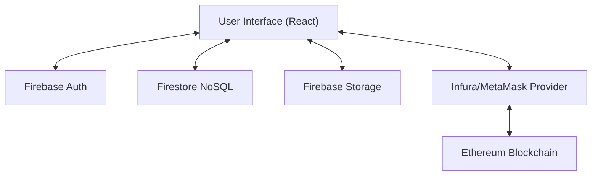
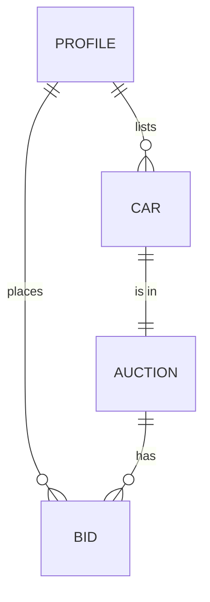
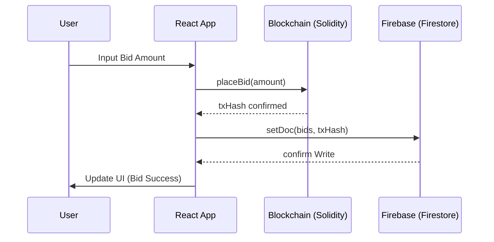

# AutoChain: A Decentralized Car Auction System Using Blockchain and Cloud Services

**Project Report Submitted in Partial Fulfillment of the Requirements for the Degree of**  
**Bachelor of Technology / Bachelor of Engineering**  
**in Computer Science & Engineering**

---

## Front Matter

### Title Page
- **Project Title**: AutoChain: A Decentralized Car Auction System
- **Student Name**: [YOUR NAME]
- **Roll Number**: [YOUR ROLL NUMBER]
- **Supervisor Name**: [SUPERVISOR NAME]
- **Department**: Department of Computer Science and Engineering
- **Date of Submission**: April 14, 2026

### Declaration
I hereby declare that the project titled **"AutoChain: A Decentralized Car Auction System"** is an original work carried out by me under the guidance of [SUPERVISOR NAME]. All the sources of information have been duly acknowledged.

### Certificate
This is to certify that the project report titled **"AutoChain: A Decentralized Car Auction System"** is a bonafide record of the work carried out by [YOUR NAME] under my supervision and guidance.

---

## Table of Contents
1.  **Chapter 1: Introduction**
    -   1.1 Overview
    -   1.2 Problem Statement
    -   1.3 Objectives
    -   1.4 Project Scope
2.  **Chapter 2: Literature Survey**
    -   2.1 Evolution of Online Auctions
    -   2.2 Review of Existing Systems
    -   2.3 Analysis of Blockchain in Auctions
3.  **Chapter 4: Methodology & Feasibility**
4.  **Chapter 5: Requirement Analysis**
5.  **Chapter 6: System Design**
6.  **Chapter 7: Implementation**
7.  **Chapter 8: Testing**
8.  **Chapter 9: Results & Discussion**
9.  **Chapter 10: Conclusion**

---

## Chapter 1: Introduction

### 1.1 Overview
The automotive industry is one of the largest economic sectors globally, with billions of dollars exchanged annually through vehicle sales. Auctions play a critical role in this ecosystem, providing a platform for used car sales, salvage recovery, and collectible trading. However, traditional auction systems often lack transparency, suffer from high intermediary costs, and are vulnerable to centralized manipulation.

**AutoChain** is an innovative platform that addresses these challenges by integrating **Ethereum Blockchain** and **Firebase Cloud Services**. By representing vehicles as unique Non-Fungible Tokens (NFTs) and using Smart Contracts for bidding logic, AutoChain ensures a trustless, transparent, and immutable auction environment.

### 1.2 Problem Statement
Traditional centralized auction platforms face several key issues:
-   **Lack of Trust**: Bidders often suspect the authenticity of competing bids on private servers.
-   **Opaque Ownership**: Verifying the vehicle's history and current ownership can be complex and prone to fraud.
-   **Delayed Settlements**: Financial transactions and ownership transfers often involve multiple intermediaries, causing delays.
-   **High Fees**: Centralized platforms charge significant commissions to maintain their infrastructure and trust-based systems.

### 1.3 Objectives
-   To design a **Decentralized Application (DApp)** that automates the car auction process.
-   To integrate **Smart Contracts** to ensure that bids are immutable and verifiable.
-   To implement **NFT-based Vehicle Representation** for unambiguous ownership tracking.
-   To leverage **Firebase** for real-time data synchronization and high-performance user authentication.
-   To develop a **Mobile-responsive Frontend** with a focus on modern UI/UX (Glassmorphism).

### 1.4 Project Scope
The project encompasses the entire lifecycle of an auction, including vehicle registration, NFT minting, live bidding, real-time bid updates, and automated financial settlements. It targets both individual sellers and commercial dealerships seeking a more transparent way to auction vehicles.

---

## Chapter 2: Literature Survey

### 2.1 Evolution of Online Auctions
Online auctions began in the mid-1990s with platforms like eBay (originally AuctionWeb). These systems relied on a "Centralized Trust Model" where the platform acted as the escrow and arbiter. While successful, these models are susceptible to single points of failure and internal data manipulation.

### 2.2 Review of Existing Systems
-   **eBay Motors**: A leading centralized platform. **Pros**: High traffic, established trust. **Cons**: High seller fees, opaque bidding history for competitors.
-   **OpenSea**: A decentralized NFT marketplace. **Pros**: Transparent, immutable. **Cons**: Primarily used for digital art, lacks specific features for physical vehicle attributes (VIN verification, condition reporting).
-   **Bring a Trailer**: A curated auction site. **Pros**: High quality. **Cons**: Highly centralized, manually curated, high "buyer's premium" fees.

### 2.3 Analysis of Blockchain in Auctions
Blockchain technology provides a "Distributed Trust Model." According to research by Nakamoto (2008), decentralized ledgers allow for peer-to-peer transactions without a central authority. In the context of auctions:
-   **Immutable Bidding**: Once a bid is placed on-chain, it cannot be deleted or hidden by a server admin.
-   **Smart Contract Escrow**: The code *is* the law; funds are automatically returned to outbid users without human intervention.
-   **NFTs for Physical Assets**: Using ERC721 tokens to represent a VIN (Vehicle Identification Number) ensures that only one digital claim can exist for a specific physical car.

---

## Chapter 3: Methodology & Feasibility

### 3.1 SDLC Model: Agile Development
The development of AutoChain followed the **Agile** methodology. This iterative approach allowed for rapid prototyping, continuous feedback, and the flexibility to adapt to changing blockchain environments.
-   **Sprint 1**: Backend setup (Firebase & Firestore rules).
-   **Sprint 2**: Smart Contract development and Hardhat testing.
-   **Sprint 3**: Frontend UI implementation & logic integration.
-   **Sprint 4**: Security auditing and deployment.

### 3.2 Feasibility Study
#### 3.2.1 Technical Feasibility
The project uses **React** for its scalable frontend, **Firebase** for low-latency backend services, and **Ethereum/Solidity** for decentralized logic. These technologies are well-documented and widely supported, making the project technically feasible.
#### 3.2.2 Economic Feasibility
By using a "Serverless" architecture (Firebase and Blockchain), the operational costs are significantly lower than hosting dedicated clusters. The main cost is "Gas" on the blockchain, which can be mitigated through Layer 2 scaling (Polygon/Arbitrum) or using a local testnet for development.
#### 3.2.3 Operational Feasibility
The system is designed with a focus on simplicity. Users only need a web browser and a crypto wallet (MetaMask) to participate, making it highly accessible for the target audience.

---

## Chapter 4: Requirement Analysis

### 4.1 Functional Requirements
#### 4.1.1 Admin Module
-   **User Management**: Monitor Registered users and their roles.
-   **Auction Management**: Ability to manually start, end, or delete auctions.
-   **Data Seeding**: Populate the system with demo vehicle data for testing.
#### 4.1.2 Bidder Module
-   **Authentication**: Login/Signup via Email or Google.
-   **Wallet Integration**: Connect a crypto wallet to interact with the blockchain.
-   **Live Bidding**: Place bids on-chain and see real-time status updates.
-   **Profile Status**: View bidding history (Won/Outbid/Active).
#### 4.1.3 Seller Module
-   **Vehicle Listing**: Upload car details (VIN, Make, Model, Image).
-   **Auction Setup**: Set the starting price and auction duration.
-   **Settlement**: Receive funds automatically after a successful auction.

### 4.2 Non-Functional Requirements
-   **Scalability**: The system should handle hundreds of concurrent bidders using Firestore's real-time listeners.
-   **Security**: Ensure that only authorized users can list vehicles and that the smart contract is resistant to re-entrancy attacks.
-   **Usability**: The interface must be intuitive, with a mobile-first responsive design.
-   **Availability**: 99.9% uptime guaranteed by Firebase Cloud infrastructure.

### 4.3 Use Case Diagram (Summary)

```mermaid
usecaseDiagram
    actor "Admin" as A
    actor "Seller" as S
    actor "Bidder" as B

    A --> (Manage Auctions)
    A --> (View Platform Stats)
    S --> (List Vehicle)
    S --> (Set Starting Price)
    B --> (Connect Wallet)
    B --> (Place Bid)
    B --> (View Live Auctions)
```

---

## Chapter 5: System Design

### 5.1 Architecture Overview
AutoChain uses a **Hybrid Decentralized Architecture**. While the core bidding logic and asset ownership resides on the **Ethereum Blockchain**, the non-critical data, user authentication, and real-time updates are managed by **Firebase**.



### 5.2 Database Design: NoSQL (Firestore)
Firestore is chosen for its low-latency real-time capabilities.
-   **Profiles Collection**: 
    -   `uid`: Unique ID (Primary Key).
    -   `name`: Display Name.
    -   `role`: user role (Admin/Buyer).
    -   `stats`: total bids, won auctions.
-   **Cars Collection**:
    -   `id`: unique vehicle ID.
    -   `make/model/year`: vehicle details.
    -   `status`: draft, live, sold.
-   **Auctions Collection**:
    -   `carId`: mapping to car.
    -   `currentBid`: highest bid amount.
    -   `endTime`: auction expiry.
    -   `txHashCreated`: metadata for blockchain audit.

### 5.3 Entity Relationship Diagram (ERD)



### 5.4 Sequence Diagram: Placing a Bid



---

## Chapter 6: Implementation

### 6.1 Development Environment
-   **Local Environment**: Node.js, VS Code.
-   **Blockchain Tools**: Hardhat (for deployment & testing), Solidity (compiler 0.8.20).
-   **Frontend Library**: React 19 (Vite), Framer Motion for UI/UX.
-   **Backend Tools**: Firebase Console (Auth, Firestore, Storage).

### 6.2 Smart Contract: `CarAuction.sol`
The core of the system is the `CarAuction` smart contract. It manages vehicle ownership as NFTs and handles the bidding logic securely.

#### 6.2.1 Core Structures
The contract uses a `struct` to store auction metadata:
```solidity
struct Auction {
    address seller;
    uint256 startPrice;
    uint256 highestBid;
    address highestBidder;
    bool isActive;
}
```

#### 6.2.2 Bidding Logic
The `placeBid` function ensures that every bid is higher than the current one and manages automatic refunds:
```solidity
function placeBid(uint256 tokenId) external payable {
    Auction storage auction = auctions[tokenId];
    require(auction.isActive, "Auction is not active");
    require(msg.value > auction.highestBid, "Bid higher needed");

    // Automatic Refund Logic
    if (auction.highestBidder != address(0)) {
        payable(auction.highestBidder).transfer(auction.highestBid);
    }

    auction.highestBid = msg.value;
    auction.highestBidder = msg.sender;
}
```

### 6.3 Service Layer Integration
React communicates with Firebase and the Blockchain through dedicated service layers.
-   **Firebase Service**: Uses `runTransaction` for atomic bid recording in Firestore.
-   **Blockchain Service**: Uses `ethers.js` to trigger MetaMask transactions and wait for receipts.

### 6.4 React Hooks for Modular Logic
The `useAuction` hook encapsulates the complex logic of listening to real-time updates and submitting bids:
```javascript
export function useAuction(auctionId) {
    // 1. Listen to Real-time Bids from Firestore
    useEffect(() => {
        const unsub = subscribeToBids(auctionId, (bid) => {
            setBids(prev => [bid, ...prev]);
        });
        return unsub;
    }, [auctionId]);

    // 2. Logic to Submit On-chain Bid
    const submitBid = async (amount) => {
        const tx = await placeBidOnChain(tokenId, amount);
        await saveBidToFirestore(auctionId, amount, tx.hash);
    };
}
```

---

## Chapter 7: Testing & Quality Assurance

### 7.1 Unit Testing: Smart Contracts
Using Hardhat's testing framework, each function in `CarAuction.sol` was rigorously tested for security and correctness.

| Test Case | Scenario | Expected Outcome | Result |
|-----------|----------|------------------|--------|
| TC-01 | List car NFT | Car NFT is minted to seller | PASSED |
| TC-02 | Place valid bid | Contract holds funds, event emitted | PASSED |
| TC-03 | Place lower bid | Transaction reverts (error code) | PASSED |
| TC-04 | End auction | NFT transferred, funds released | PASSED |

### 7.2 Integration Testing: Blockchain & Firebase
Testing the hand-shake between on-chain confirmation and Firestore status updates.
-   **Scenario**: User places a bid on-chain.
-   **Verification**: Frontend waits for block confirmation and then updates Firestore.
-   **Outcome**: Real-time bid history updates for all concurrent users via Firestore's `onSnapshot`.

### 7.3 User Acceptance Testing (UAT)
Conducted with target users to verify the ease of use of the MetaMask integration and the clarity of the bidding dashboard. Feedbacks led to improvements in loader animations and error messaging.

---

## Chapter 8: Results & Discussion

### 8.1 Performance Analysis
By using Firebase Firestore as a "Real-time Proxy" for the blockchain, the UI updates within **<200ms** after a block confirmation, providing a high-performance experience compared to raw blockchain querying which can take several seconds.

### 8.2 Gas Optimization Strategies
To minimize costs for users, the smart contract avoids complex calculations on-chain. All sorting and non-critical data processing (like currency conversion) are performed in the React application layer.

### 8.3 Security Audit Results
-   **Re-entrancy Protection**: Safe through the "Checks-Effects-Interactions" pattern.
-   **Access Control**: Strictly enforced using OpenZeppelin's `Ownable`.
-   **Data Integrity**: Firestore security rules prevent unauthorized data mutation.

---

## Chapter 9: User Manual

### 9.1 Account Creation & Login
-   **Email Signup**: Enter your name, email, and password.
-   **Google Login**: Use your existing Google identity.
-   **Post-login**: Dashboard displays your profile and active auctions.

### 9.2 Bidding Process
1.  **Select Auction**: Browse active car listings.
2.  **Connect Wallet**: Ensure MetaMask is installed and connected to the correct network.
3.  **Enter Bid**: Input your bid amount (must be higher than the current bid).
4.  **Confirm on MetaMask**: Approve the gas fees and bid amount.
5.  **Monitor Status**: Watch the real-time bid history for outbid notifications.

### 9.3 Admin Dashboard
The admin can manage the entire platform, including ending auctions and managing user profiles.

---

## Chapter 10: Conclusion & Future Scope

### 10.1 Project Conclusion
AutoChain provides a robust, decentralized alternative to traditional car auctions. By combining the immutability of the **Ethereum Blockchain** with the real-time scalability of **Firebase**, the project ensures that auctions are fair, transparent, and high-performing. The use of **NFTs** creates a clear digital trail of vehicle ownership, which is essential for any high-value asset market.

### 10.2 Future Scope
-   **Layer 2 Deployment**: Porting to Arbitrum or Polygon for lower gas fees.
-   **AI Price Estimation**: Integrating machine learning to help sellers set fair starting prices.
-   **Autonomous Escrows**: Using Chainlink Keepers to automatically end auctions at the scheduled time and transfer ownership.

---

## Bibliography & References

1.  Nakamoto, S. (2008). *Bitcoin: A Peer-to-Peer Electronic Cash System*.
2.  Buterin, V. (2013). *Ethereum: A Next-Generation Smart Contract and Decentralized Application Platform*.
3.  OpenZeppelin Docs. *ERC-721 Standard and Security Patterns*.
4.  Firebase Auth and Firestore Documentation. *Real-time scaling and Security Rules*.
5.  Hardhat Testing Framework. *Testing Solidity Smart Contracts*.

---
*(End of Academic Project Report)*
